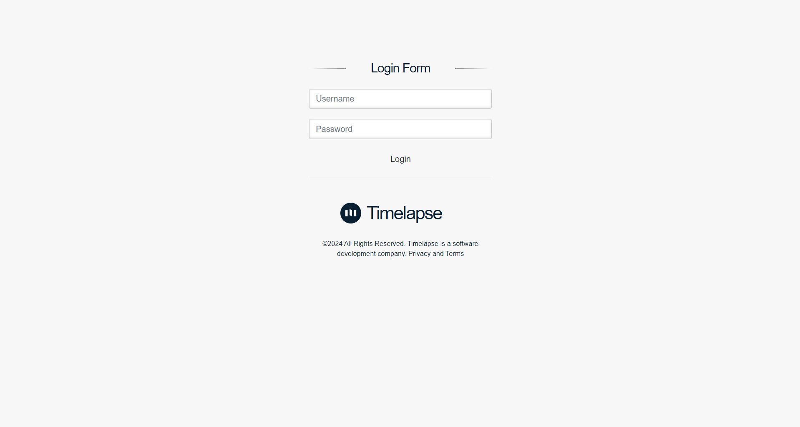
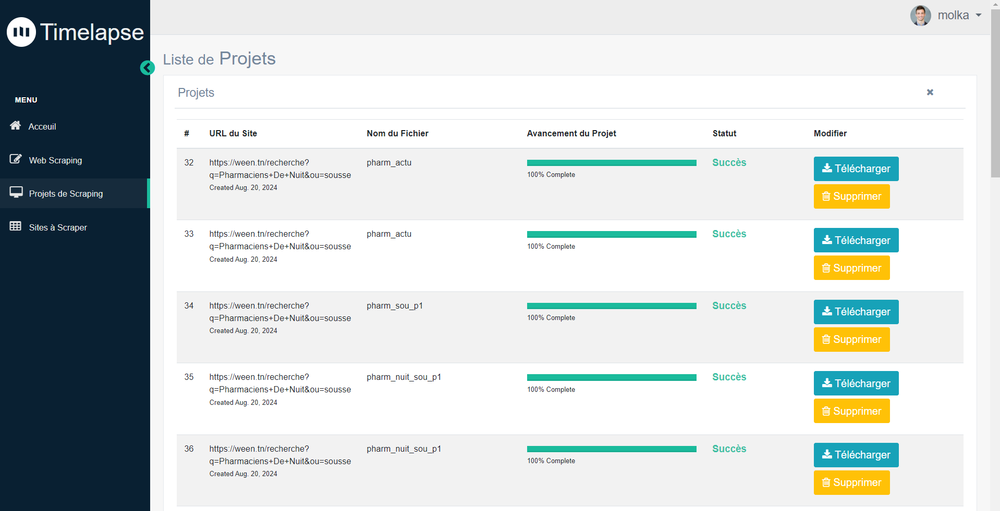
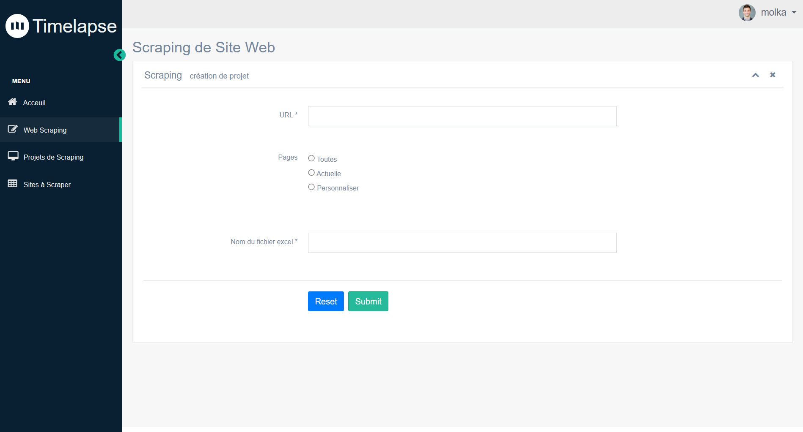
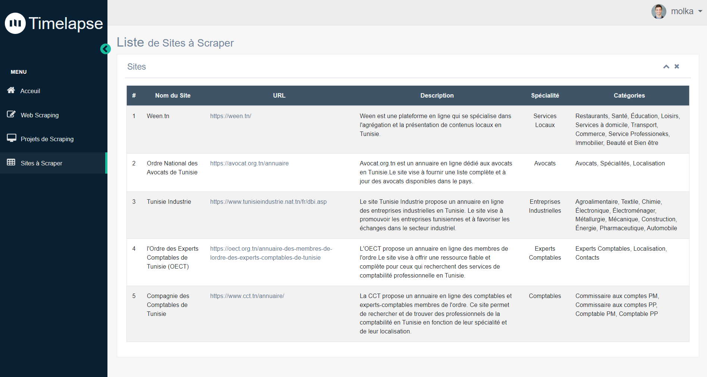

# Scraping_Plateform

A web-based scraping platform developed with **Python** and **Django**, designed to collect data from multiple websites and export it into Excel files.  
It provides an easy-to-use interface for managing scraping projects, tracking progress, and downloading results.

---
## 🌐 General Idea

The platform allows users to:

- Create scraping projects for different websites.
- Choose which pages to scrape (all pages, current page, or custom selection).
- Track the scraping progress in real-time.
- Download the resulting Excel file containing the scraped data.
- Access previous projects and their scraped data.

It is ideal for collecting structured data for analytics, reporting, or database creation.

---
## 📄 Pages & Features

1. **Login / Registration Page**  
   - User authentication  
   - Allows new users to sign up and existing users to log in  


   


2. **Dashboard / Projects Page**  
   - View all existing scraping projects  
   - Access details and download results  


   


3. **Scraping Form Wizard**  
   - Enter the website URL  
   - Select the scraping option (all pages / current page / custom pages)  
   - Enter the name of the Excel file to save the data  
   - Execute scraping and track progress  


   

4. **Sites Selection Page**  
   - Lists all available websites that can be scraped  
   - Users select the site they want to scrape before starting a project  
   - Each site may have different scraping options or requirements 


   

5. **Download File**  
   - Download the generated Excel file  

---

## 🏗️ Technologies Used

- **Backend:** Python, Django  
- **Frontend:** HTML, CSS, JavaScript, Bootstrap  
- **Scraping Libraries:** Selenium, BeautifulSoup, Requests, Pandas  
- **Database:** SQLite (default with Django)  
- **Environment Management:** virtualenv, pip  

---
## 🚀 Installation
1. Clone the repository:

```bash
git clone https://github.com/MolkaSahli/Scraping_Plateform.git
cd Scraping_Plateform
```

2. Create and activate a virtual environment:

```bash
python -m venv venv
venv\Scripts\activate
```

3. Install dependencies:
```bash
pip install -r requirements.txt
```
4. Apply Django migrations:

```bash
python manage.py migrate
```

5. Run the server:

```bash
python manage.py runserver
```

6. Open your browser at http://127.0.0.1:8000/ to access the platform.